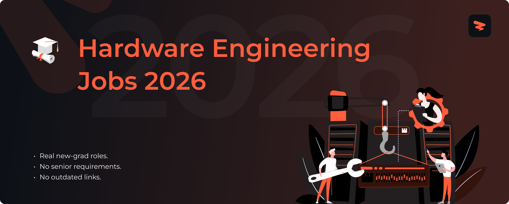

<!-- Banner -->

# Hardware Engineering Jobs 2026

 

<!-- Row 1: Job Stats (Custom Static Badges) -->

<!-- Row 2: Repository Stats -->

<!-- Row 3: Workflow Health -->

<!-- Row 4: Community & Links (for-the-badge style) -->

<!-- Zapply extension badge - add when extension launches -->
<!--  -->

🚀 Job opportunities from 5+ top companies • Updated daily • US Positions.

🎯 Fresh hardware engineering jobs scraped directly from company career pages. Open positions from FAANG, unicorns, and elite startups, updated every 10 minutes.

> [!TIP]
> 🛠  Help us grow! Add new jobs by submitting an issue! View [contributing steps](CONTRIBUTING-GUIDE.md) here.

---

## Join Our Community

Connect with fellow job seekers, get career advice, share experiences, and stay updated on the latest opportunities. Join our community of new grads and students navigating their career journey together!

  
  &nbsp;&nbsp;&nbsp;&nbsp;
  

---

## Alerts

**Don't miss new opportunities!**  
- 🌟 **Star this repo** to get updates on your GitHub dashboard.
- 👁️ **Watch** for instant notifications on new jobs.
- 🔔 **Turn on notifications** to never miss FAANG+ postings.

---

## Live Stats

- **🔥 Current Positions**: 10 
- **🏢 Companies**: 5 companies 
- **⭐ FAANG+ Jobs**: 5 premium opportunities 
- **📅 Last Updated**: January 5, 2026 
- **🤖 Next Update**: Tomorrow at 9 AM UTC

---

## Fresh Hardware Jobs 2026

### ⭐ **FAANG+** (5 positions)

#### 📦 **Amazon** (1 position)

| Role | Location | Level | Apply Now | Age |
|------|----------|-------|-----------|-----|
| Systems Development Engineer, AWS Hardware Engineering | Seattle, WA |  |  | 6d |

#### 🟢 **Google** (4 positions)

| Role | Location | Level | Apply Now | Age |
|------|----------|-------|-----------|-----|
| Hardware Engineer, Platforms, University Graduate | Sunnyvale, CA |  |  | 4d |
| Hardware Test Engineer, Verification Engineering | Council Bluffs, IA |  |  | 4d |
| Hardware Signal Integrity Test Engineer, Platforms, University Graduate | Sunnyvale, CA |  |  | 4d |
| Camera Firmware Engineer | Mountain View, CA |  |  | 4d |

### 🏢 **Top Tech** (2 positions)

#### 🔶 **AMD** (2 positions)

| Role | Location | Level | Apply Now | Age |
|------|----------|-------|-----------|-----|
| High-Speed Signal Integrity & Power Integrity Validation Engineer | Santa Clara, CA |  |  | 4d |
| Design Verification Engineer | Austin, TX |  |  | 4d |

### 🚀 **Startups & Growth** (3 positions)

#### 🛡️ **BAE Systems** (1 position)

| Role | Location | Level | Apply Now | Age |
|------|----------|-------|-----------|-----|
| RF Electrical Engineer | Colorado Springs, CO |  |  | 5d |

#### ⚙️ **General Dynamics** (2 positions)

| Role | Location | Level | Apply Now | Age |
|------|----------|-------|-----------|-----|
| Hardware Engineer - Top Secret | Arlington, VA |  |  | 2d |
| Hardware Engineer (Tactical Network - CANES) - Active Secret clearance | San Diego, CA |  |  | 2d |

---

## Insights on the Repo

### 🏢 Top Companies

#### ⭐ **FAANG+** (2 companies)
🟢 **[Google](https://www.google.com/about/careers/applications/jobs)** (4 positions) • 📦 **[Amazon](https://amazon.jobs/en-gb/search)** (1)

#### ☁️ **Enterprise & Cloud** (1 company)
🔶 **[AMD](https://careers.amd.com/careers-home/jobs)** (2 positions)

---

### 📈 Experience Breakdown

| Level               | Count | Percentage | Top Companies                     |
|---------------------|-------|------------|-----------------------------------|
| 🟢 Entry Level & New Grad | 3 | 30% | No or minimal experience |
| 🟡 Beginner & Early Career | 3 | 30% | 1-2 years of experience |
| 🔴 Manager         | 4 | 40% | 2+ years of experience |

---

### 🌍 Top Locations

- **Sunnyvale, CA**: 2 positions
- **Arlington, VA**: 1 position
- **San Diego, CA**: 1 position
- **Santa Clara, CA**: 1 position
- **Council Bluffs, IA**: 1 position
- **Mountain View, CA**: 1 position
- **Colorado Springs, CO**: 1 position
- **Seattle, WA**: 1 position

---

### 🔮 Why Hardware Engineers Choose Our Job Board

✅ **100% Real Jobs:** 10+ verified CS internships and entry-level hardware roles from 5 elite tech companies.
 
✅ **Fresh Daily Updates:** Live company data from Tesla, Raytheon, Chewy, and CACI refreshed every 10 minutes automatically.
 
✅ **Entry-Level Focused:** Smart filtering for CS majors, new grads, and early-career engineers.
 
✅ **Intern-to-FTE Pipeline:** Track internships that convert to full-time Hardware Engineering roles.
 
✅ **Direct Applications:** Skip recruiters -- apply straight to company career pages for Tesla, Amazon, and NVIDIA positions.
 
✅ **Mobile-Optimized:** Perfect mobile experience for CS students job hunting between classes.

---

## Job Hunt Tips That Actually Work

### 🔍 **Research Before Applying**
- **Find the hiring manager:** Search "[Company] [Team] engineering manager" on LinkedIn.
- **Check recent tech decisions:** Read their engineering blog for stack changes or new initiatives.
- **Verify visa requirements:** Look for 🇺🇸 indicator or "US persons only" in job description.
- [Use this 100% ATS-compliant and job-targeted resume template](https://docs.google.com/document/d/1EcP_vX-vTTblCe1hYSJn9apwrop0Df7h/export?format=docx).

### 📄 **Resume Best Practices**
- **Mirror their tech stack:** Copy exact keywords from job post (React, Django, Node.js, etc.).
- **Lead with business impact:** "Improved app speed by 30%" > "Used JavaScript."
- **Show product familiarity:** "Built Netflix-style recommendation engine" or "Created Stripe payment integration."
- [Read this informative guide on tweaking your resume](https://drive.google.com/uc?export=download&id=1H6ljywqVnxONdYUD304V1QRayYxr0D1e).

### 🎯 **Interview Best Practices**
- **Ask tech-specific questions:** "How do you handle CI/CD at scale?" shows real research.
- **Prepare failure stories:** "Migration failed, learned X, rebuilt with Y" demonstrates growth mindset.
- **Reference their products:** "As a daily Slack user, I've noticed..." proves genuine interest.
- [Review this comprehensive interview guide on common behavioral, technical, and curveball questions](https://drive.google.com/uc?export=download&id=1MGRv7ANu9zEnnQJv4sstshsmc_Nj0Tl0).

  
  &nbsp;&nbsp;&nbsp;&nbsp;
  
  &nbsp;&nbsp;&nbsp;&nbsp;
  

---

## Become a Contributor

Add new jobs! See the [contributing guide](CONTRIBUTING-GUIDE.md).

### Contributing Guide
#### 🎯 Roles We Accept
- Located in the US, Canada, or Remote.
- Not already in our database.
- Currently accepting applications.

#### 🚀 How to Add Jobs
1. Create a new issue.
2. Select the "New Job" template.
3. Fill out and submit the form.
   > Submit separate issues for each position, even from the same company.

#### ✏️ How to Update Jobs
1. Copy the job URL to edit.
2. Create a new issue.
3. Select the "Edit Job" template.
4. Paste the URL and describe changes.

#### ⚡ What Happens Next
- Our team reviews within 24-48 hours.
- Approved jobs are added to the main list.
- The README updates automatically via script.
- Contributions go live at the next daily refresh (9 AM UTC).
- Questions? Create a miscellaneous issue, and we’ll assist! 🙏

---

<h2>📁 <strong>Archived SWE Jobs</strong> - 37 (7+ days old) - Click to Expand</h2>

> Either still hiring or useful for research.

### **Archived Job Stats**
- **📁 Total Jobs**: 37 positions
- **🏢 Companies**: 5 companies  
- **⭐ FAANG+ Jobs & Internships**: 25 roles

### ⭐ **FAANG+** (25 positions)

#### 📦 **Amazon** (2 positions)

| Role | Location | Level | Apply Now | Age |
|------|----------|-------|-----------|-----|
| Systems Development Eng (AWS Generative AI & ML Servers), AWS Hardware Engineering Accelerators | Cupertino, CA |  |  | 3w |
| Electrical Engineer, Amazon Leo | Redmond, WA |  |  | 3w |

<h4>🟢 <strong>Google</strong> (16 positions)</h4>

| Role | Location | Level | Apply Now | Age |
|------|----------|-------|-----------|-----|
| Physical Design Engineer, 3D Technology, PhD, University Graduate | Sunnyvale, CA |  |  | 1w |
| Physical Design Engineer, Google Cloud | Sunnyvale, CA |  |  | 1w |
| Physical Design Engineer, University Graduate, PhD | Sunnyvale, CA |  |  | 1w |
| Hardware Engineer, Google Pixel | Mountain View, CA |  |  | 2w |
| Hardware Power Test Engineer, Platforms | Sunnyvale, CA |  |  | 2w |
| Hardware Test Engineer, Optics | Mountain View, CA |  |  | 2w |
| Power Systems Engineer, Google Data Centers | Reston, VA |  |  | 2w |
| ASIC Design Verification Engineer, Machine Learning | Sunnyvale, CA |  |  | 2w |
| ASIC Design Verification Engineer, University Graduate | Sunnyvale, CA |  |  | 2w |
| RTL Design Engineer, University Graduate, PhD, Machine Learning | Sunnyvale, CA |  |  | 2w |
| Hardware Validation Engineer, Cloud Platforms | Mountain View, CA |  |  | 1mo |
| System Hardware Reliability Engineer | Atlanta, GA |  |  | 1mo |
| CPU Design Verification Engineer, Silicon, University Graduate | Poughkeepsie, NY |  |  | 1mo |
| Product Design Engineer, Pixel Hardware | Mountain View, CA |  |  | 3w |
| SoC Physical Design Engineer | Sunnyvale, CA |  |  | 3w |
| DFT Engineer, Google Cloud | Sunnyvale, CA |  |  | 3w |

#### 🍎 **Apple** (7 positions)

| Role | Location | Level | Apply Now | Age |
|------|----------|-------|-----------|-----|
| Hardware System Engineer | Cupertino, CA |  |  | 3w |
| Hardware System Modeling Engineer - iPhone | Cupertino, CA |  |  | 3w |
| Hardware Systems Engineer - Board Design | Cupertino, CA |  |  | 3w |
| Administrative Assistant, Hardware Technology | Sunnyvale, CA |  |  | 3w |
| iPhone Hardware System Design Engineer | Cupertino, CA |  |  | 3w |
| Administrative Assistant, Hardware Technology | Boulder, CO |  |  | 3w |
| Image Quality Field Test Engineer - Camera Hardware | Cupertino, CA |  |  | 3w |

### 🏢 **Top Tech** (6 positions)

#### 🎮 **NVIDIA** (2 positions)

| Role | Location | Level | Apply Now | Age |
|------|----------|-------|-----------|-----|
| ASIC Hardware Design Engineer - New College Grad | Austin, TX |  |  | 3w |
| ASIC Design Engineer, Hardware Tools and Methodology Development | Austin, TX |  |  | 3w |

#### 🔶 **AMD** (4 positions)

| Role | Location | Level | Apply Now | Age |
|------|----------|-------|-----------|-----|
| Hardware Design Engineer | Austin, TX |  |  | 3w |
| Hardware Applications Engineer | TX |  |  | 1mo |
| Power Methodology Engineer, Data Center Hardware IPs | Santa Clara, CA |  |  | 4w |
| FPGA Prototyping and Emulation Engineer | Austin, TX |  |  | 1mo |

### 💻 **Enterprise Hardware** (3 positions)

#### 🖥️ **Hewlett Packard Enterprise** (1 position)

| Role | Location | Level | Apply Now | Age |
|------|----------|-------|-----------|-----|
| FPGA Engineer | Spring, TX |  | [](https://hpe.wd5.myworkdayjobs.com/en-US/WFMathpe/job/Spring-Texas-United-States-of-America/FPGA-Engineer_1193459-2?q=hardware+engineering&locations=e459dee6bf0a01f51082fd2708240d5c&locations=3950c424ea1c01d5b87223aa442cc958&locations=e69f9781661b10219199635d840babb5&locations=bb84e32ded880145afe5d2d0dd2b5c62&locations=f607629c2aa1010d124a5599402c703f&locations=e69f9781661b102191a28884e0f0b85f&locations=e459dee6bf0a01607d49d56409244b64&locations=e69f9781661b1021919815e9ca32a9ee&locations=bb84e32ded88013ee847c281d92b6745&locations=90058e87ba0e1001d2f4d7e27b0d0000&locations=47385449f64a017d4c903202dc2b5657&locations=98cbd30d374e10330ceffda6d7a4fc41&locations=2e0d9cc9554b01deafe88869442cb356&locations=acac3e510b17018644380803dc2b7f55&locations=bb84e32ded88017f2a05da01dc2b4656&locations=2e0d9cc9554b01761ed1696d442cbe56&locations=62b0c47c914b015d3c97fb6707248955&locations=acac3e510b1701630be274ffdb2b6d55&locations=98cbd30d374e10330cf05e491004fc5f&locations=cc3bff87cf8101bded44c0f2dc00e375&locations=f607629c2aa10196b908a08e462c0567) | 2w |

#### 📡 **Broadcom** (2 positions)

| Role | Location | Level | Apply Now | Age |
|------|----------|-------|-----------|-----|
| R&D Engineer IC Design | Irvine, CA |  |  | 2w |
| Board Hardware Engineer | Duluth, GA |  |  | 3w |

### 🚀 **Startups & Growth** (2 positions)

#### 🛡️ **BAE Systems** (2 positions)

| Role | Location | Level | Apply Now | Age |
|------|----------|-------|-----------|-----|
| Hardware Reverse Engineer | Quantico, VA |  |  | 2w |
| Hardware Vulnerability Researcher | Quantico, VA |  |  | 2w |

### 🏭 **Manufacturing & Industrial** (1 position)

#### 💪 **Arm** (1 position)

| Role | Location | Level | Apply Now | Age |
|------|----------|-------|-----------|-----|
| Hardware Emulation Engineer | San Diego, CA |  |  | 2w |

---

## More Resources

  
  &nbsp;&nbsp;
  
  &nbsp;&nbsp;
  

  
  &nbsp;&nbsp;
  
  &nbsp;&nbsp;
  

  
  &nbsp;&nbsp;
  
  &nbsp;&nbsp;
  

---

**🎯 10 current opportunities from 5 elite companies.**

**Found this helpful? Give it a ⭐ to support us!**

*Not affiliated with any companies listed. All applications redirect to official career pages.*

---

**Last Updated:** January 5, 2026 • **Next Update:** Daily at 9 AM UTC

