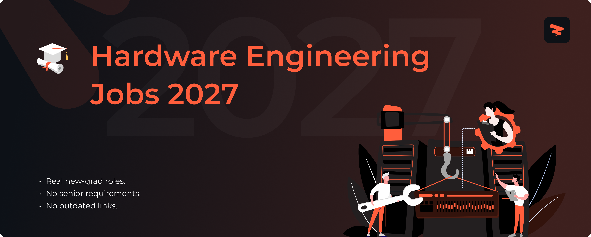

<!-- Cover -->

# Hardware Engineering Jobs 2027

🚀 Hardware, embedded systems, and EE jobs for new graduates, updated in real time.

> [!TIP]
> 🛠 Help us grow! Add new jobs by submitting an issue! View contributing steps [here](CONTRIBUTING-GUIDE.md).
---

## **Website & Autofill Extension**

Explore Zapply's website and check out:

- Our chrome extension that autofills your job applications in seconds.
- A dedicated job board with the latest jobs for various types of roles.
- User account providing multiple profiles for different resume roles.
- Job application tracking with streaks to unlock commitment awards.

Experience an advanced career journey with us! 🚀

  

## Explore Around

Connect and seek advice from a growing network of fellow students and new grads.

  
  &nbsp;&nbsp;
  
  &nbsp;&nbsp;
  

---

<h3>⚡ <strong>Hardware Engineer</strong></h3>

| Company | Role | Location | Posted | Visa | **Apply** |
|---------|------|----------|--------|------|----------|
| **Eversource Energy** | Field Service Representative | Lancaster, NH | 9m | 🏛 H-1B Co. |  |
| **Eversource Energy** | Supervisor, Field Engineering (Waltha... | Waltham, MA | 9m | 🏛 H-1B Co. |  |
| **Workday Inc** | (Sr) Site Reliability Engineer (US Fe... | USA.VA.Reston | 9m | 🏛 H-1B Co. |  |
| **Zayo** | Field Technician III - Ashburn, VA | Ashburn, VA | 10m | 🏛 H-1B Co. |  |
| **Zayo** | DWDM Network Engineer | USA | 10m | 🏛 H-1B Co. |  |
| **Wells Fargo** | AI Systems Operations Engineer  Enter... | CHARLOTTE, NC | 10m |  |  |
| **Thermo Fisher Scientific** | IBM Process & Tooling Engineer | Rochester, New Yo... | 10m |  |  |
| **Thermo Fisher Scientific** | Engineer I, Process Engineer | Fair Lawn, New Je... | 10m | 🏛 H-1B Co. |  |
| **Thermo Fisher Scientific** | Production Engineer (2-2-3 schedule N... | Greenville, North... | 10m | 🏛 H-1B Co. |  |
| **Vertex Pharmaceuticals** | Product Development Engineering Scien... | Boston, MA | 10m | 🏛 H-1B Co. |  |
| **Philips** | Field Service Engineer, Ultrasound (F... | Boston, Massachus... | 10m | 🏛 H-1B Co. |  |
| **Philips** | Field Service Engineer - Boston, MA | Boston, Massachus... | 10m | 🏛 H-1B Co. |  |
| **Philips** | Field Service Engineer - Boston, MA | Boston, Massachus... | 10m | 🏛 H-1B Co. |  |
| **State Street** | Visual Graphic Designer, Brand and Cr... | Boston, Massachus... | 11m | 🏛 H-1B Co. |  |
| **Pfizer** | Facilities Electrical Engineer | New York | 11m |  |  |
| **NXP** | N2 AMHS EquipmentTechnician | Austin | 11m |  |  |
| **NXP** | CVD Equipment Engineer | Chandler | 11m |  |  |
| **NXP** | Technical Sales & Applications Progra... | Austin | 11m | 🏛 H-1B Co. |  |
| **Northrop Grumman** | Structural Engineer - 2 | Utah | 11m |  |  |
| **Northrop Grumman** | Software Engineer - Level 1 | Alabama | 11m |  |  |
| **Northrop Grumman** | Facilities Planner Level 3 | Arizona | 11m |  |  |
| **RTX** | Product Test Specialist | Tucson, AZ | 11m | 🏛 H-1B Co. |  |
| **RTX** | Power Design Electrical Engineer II | Huntsville, AL | 11m | 🏛 H-1B Co. |  |
| **RTX** | Mechanical Engineer II, Model Based E... | Remote, OH | 11m | 🏛 H-1B Co. |  |
| **Magna** | Group Controller, Global Mechatronics | Newmarket, Ontari... | 11m | 🏛 H-1B Co. |  |
| **Magna** | Paint Maintenance Engineer | Nashville, Illino... | 11m | 🏛 H-1B Co. |  |
| **Motorola Solutions** | Project Manager Northeast Region - US... | Massachusetts Rem... | 11m | 🏛 H-1B Co. |  |
| **Motorola Solutions** | Electronics Design Engineer | Los Angeles, CA | 11m | 🏛 H-1B Co. |  |
| **Microchip Technology** | Technician III- Equipment (Implant) | Colorado Springs, CO | 11m | 🏛 H-1B Co. |  |
| **Micron Technology** | Product Yield Enhancement Engineer, HBM | Boise, ID - Main ... | 11m | 🏛 H-1B Co. |  |
| **Micron Technology** | New College Grad - Product Yield Enha... | Boise, ID - Main ... | 11m |  |  |
| **Micron Technology** | New College Grad - Product Yield Enha... | Boise, ID - Main ... | 11m |  |  |
| **Micron** | ENGINEER, DEMQRA AUTOMOTIVE PQRE | Manassas VA Fab 6... | 11m | 🏛 H-1B Co. |  |
| **Micron** | ENGINEER, DEMQRA AUTOMOTIVE PQRE | Manassas VA Fab 6... | 11m | 🏛 H-1B Co. |  |
| **Micron** | Wet Mechanical Operations Engineer | Syracuse, NY - Do... | 11m | 🏛 H-1B Co. |  |
| **Moog** | Mechanical Design Engineer | Phoenix, AZ | 11m |  |  |
| **Moog** | Regional Business Development Manager... | Huntsville, AL | 11m |  |  |
| **HARMAN International** | 3D Motion Designer-Unity | Michigan, USA | 12m |  |  |
| **KLA** | Applications Development Engineer - FaST | Hillsboro, OR | 12m | 🏛 H-1B Co. |  |
| **Guidehouse** | Quantum Physicist | VA, Ballston | 12m | 🏛 H-1B Co. |  |
| **Leidos** | Mobile Device Engineer | Washington, DC | 12m | 🏛 H-1B Co. |  |
| **Leidos** | Distribution Engineer | Allentown, PA + 1... | 12m | 🏛 H-1B Co. |  |
| **Leidos** | Telecommunications Engineer Specialis... | Newport News, VA | 12m | 🏛 H-1B Co. |  |
| **KBR** | Systems Analyst (Geophysics) | Patrick AFB, Florida | 12m | 🏛 H-1B Co. |  |
| **KBR** | GNC Engineer - Hybrid (TS/SCI Clearance) | U.S. | 12m | 🏛 H-1B Co. |  |
| **KBR** | Opto-Mechanical Designer​ - REMOTE | U.S. | 12m | 🏛 H-1B Co. |  |
| **General Motors** | Calibration Engineer | Milford, Michigan... | 12m | 🏛 H-1B Co. |  |
| **General Motors** | Hardware Design Engineer - PCB layout | 2 Locations | 12m | 🏛 H-1B Co. |  |
| **General Motors** | Paint Process Engineer / Tech Support | Lansing, Michigan... | 12m | 🏛 H-1B Co. |  |
| **Johnson Controls** | Fire Alarm Installer | Kentucky | 12m | 🏛 H-1B Co. |  |
| **Johnson Controls** | Fire Installer | Florida | 12m | 🏛 H-1B Co. |  |
| **Johnson Controls** | Fire Alarm Installer | Kentucky | 12m | 🏛 H-1B Co. |  |
| **Johnson & Johnson** | Injection Molding Process Engineer | Anasco, Puerto Ri... | 12m | 🏛 H-1B Co. |  |
| **Johnson & Johnson** | Mechanical Designer/Drafter | Santa Clara, Cali... | 12m | 🏛 H-1B Co. |  |
| **Johnson & Johnson** | Field Service Engineer | 4 Locations | 12m | 🏛 H-1B Co. |  |
| **GE Vernova** | Lab & Automation Engineer | Rochester | 12m | 🏛 H-1B Co. |  |
| **GE Vernova** | GE Vernova Nuclear Edison Engineering... | Wilmington NC USA | 12m | 🏛 H-1B Co. |  |
| **Danaher** | Field Service Engineer - Boston, MA | Boston, Massachus... | 12m | 🏛 H-1B Co. |  |
| **Danaher** | Field Service Engineer-Baltimore, MD/... | Washington DC, Un... | 12m | 🏛 H-1B Co. |  |
| **Fidelity Investments** | Site Reliability Engineer | Smithfield, RI + ... | 12m | 🏛 H-1B Co. |  |
| **FLIR Systems** | Process Engineer | Goleta, CA | 12m |  |  |
| **FLIR Systems** | Technical Product Service Engineer | Hudson, NH | 12m |  |  |
| **FLIR Systems** | Embedded Hardware Engineer (PCB & FPGA) | Oak Ridge, TN | 12m |  |  |
| **Entegris** | Metrology Technician | Colorado Springs, CO | 12m | 🏛 H-1B Co. |  |
| **Disney** | Graphic Designer | Anaheim, CA, USA | 12m | 🏛 H-1B Co. |  |
| **Curtiss-Wright** | Applications Engineer | Cincinnati, OH | 12m | 🏛 H-1B Co. |  |
| **Cardinal Health** | Intern, Nuclear Pharmacy-Temporary- | Highland, IN | 12m | 🏛 H-1B Co. |  |
| **Carrier Global** | Field Engineer - Automated Logic | CAA11: ALC West A... | 12m | 🏛 H-1B Co. |  |
| **Carrier Global** | Field Engineer - Automated Logic | CAN12: ALC West N... | 12m | 🏛 H-1B Co. |  |
| **Carrier Global** | Master Field Engineer - Automated Logic | CAP25: Pittsburgh... | 12m | 🏛 H-1B Co. |  |
| **Caterpillar** | Manufacturing Controls Engineer | Decatur, Illinois | 12m | 🏛 H-1B Co. |  |
| **Caterpillar** | Controls Engineering Specialist – EH ... | Mossville, Illinois | 12m | ✅ Sponsor |  |
| **Caterpillar** | Corinth Reman Manufacturing Engineeri... | Corinth, Mississippi | 12m | 🏛 H-1B Co. |  |
| **CAE** | Process Asset Library Administrator | 2 Locations | 13m | 🏛 H-1B Co. |  |
| **Cisco** | Mechanical Engineer (Onsite) | San Jose, Califor... | 13m | 🏛 H-1B Co. |  |
| **Crane Co.** | Electronics Technician II - Repair/Ov... | Burbank, California | 13m |  |  |
| **Crane Co.** | Electronics Technician II | West Caldwell, Ne... | 13m |  |  |
| **Clarios** | Controls Engineer | OH | 13m | 🏛 H-1B Co. |  |
| **Clarios** | Controls Specialist | OH | 13m | 🏛 H-1B Co. |  |
| **Boeing** | Entry-Level Systems Engineer (Digital... | El Segundo, CA | 13m | 🏛 H-1B Co. |  |
| **Boeing** | Technical Product Delivery Specialist... | Seal Beach, CA | 13m | 🏛 H-1B Co. |  |
| **Boeing** | Mission Operations Engineer (Mid Leve... | El Segundo, CA | 13m | 🏛 H-1B Co. |  |
| **Booz Allen Hamilton** | Network Engineer | Norfolk, VA | 13m | 🏛 H-1B Co. |  |
| **Booz Allen Hamilton** | Network Engineer | San Antonio, TX | 13m | 🏛 H-1B Co. |  |
| **Booz Allen Hamilton** | Integration Engineer | Beavercreek, OH | 13m | 🏛 H-1B Co. |  |
| **Blue Origin** | Facilities Design Structural Engineer... | Space Coast, FL +... | 13m | 🏛 H-1B Co. |  |
| **Blue Origin** | Manager, Core Electronics Functional ... | Greater Seattle Area | 13m | 🏛 H-1B Co. |  |
| **Blue Origin** | Manufacturing Engineer III - Electron... | Longmont, CO | 13m | 🏛 H-1B Co. |  |
| **Avnet** | Global IT Auditor | Phoenix, Arizona,... | 13m | 🏛 H-1B Co. |  |
| **Nokia** | AI R&D Engineer Co-op | Sunnyvale, CA | 14m |  |  |
| **Nokia** | AI R&D Engineer Co-op | Sunnyvale, CA | 14m |  |  |
| **Nokia** | AI R&D Engineer Co-op | Sunnyvale, CA | 14m |  |  |
| **Tesla** | Radio Frequency Engineer Intern - Rad... | Palo Alto, CA | 14m |  |  |
| **Tesla** | Data Capture Engineering Intern - Dat... | Palo Alto, CA | 14m |  |  |
| **PennState University** | Research and Development Engineering ... | State College, PA | 14m |  |  |
| **Cirrus Logic** | Co-op - Design Verification Engineer | Austin, TX | 14m | 🏛 H-1B Co. |  |
| **Cirrus Logic** | Co-Op - Formal Verification Engineer | Austin, TX | 14m | 🏛 H-1B Co. |  |
| **Robert Bosch Venture Capital** | Wireless Sensing Research Intern | Sunnyvale, CA | 14m |  |  |
| **Tesla** | Service Engineering Intern - Product ... | Palo Alto, CA | 14m |  |  |
| **Meta** | Research Scientist Intern, Advanced M... | Redmond, WA | 14m | 🏛 H-1B Co. |  |

Apply for more jobs at

<h3>🔲 <strong>FPGA/ASIC</strong></h3>

| Company | Role | Location | Posted | Visa | **Apply** |
|---------|------|----------|--------|------|----------|
| **Eversource Energy** | Associate Engineer, Substation Engine... | Manchester, NH | 9m | 🏛 H-1B Co. |  |
| **Eversource Energy** | Associate Engineer (Civil), Transmiss... | Hartford, CT | 9m | 🏛 H-1B Co. |  |
| **NVIDIA** | ASIC Floorplan Design Engineer - New ... | US, CA, Santa Clara | 11m | 🏛 H-1B Co. |  |
| **Pfizer** | Technical Associate, BRD Lab Support | Massachusetts | 11m |  |  |
| **Northrop Grumman** | 2026 Associate Electronics Engineer/E... | 4 Locations | 11m |  |  |
| **Northrop Grumman** | 2026 Associate Mechanical Engineer/Me... | California | 11m |  |  |
| **Northrop Grumman** | 2027 Associate Engineer Electrical/En... | Florida | 11m |  |  |
| **Micron Technology** | SoC Timing (Static Timing Analysis/ST... | Richardson, TX | 11m | 🏛 H-1B Co. |  |
| **Micron Technology** | SOC Timing Analysis (STA) Engineer ,HBM | Richardson, TX | 11m | 🏛 H-1B Co. |  |
| **Micron** | SoC Timing (Static Timing Analysis/ST... | Richardson, TX | 11m | 🏛 H-1B Co. |  |
| **Micron** | SOC Timing Analysis (STA) Engineer ,HBM | Richardson, TX | 11m | 🏛 H-1B Co. |  |
| **Carrier Global** | Associate Field Engineer - Automated ... | CAA11: ALC West A... | 12m | 🏛 H-1B Co. |  |
| **Carrier Global** | Associate Field Engineer - Automated ... | CO56: ALC Colorado | 12m | 🏛 H-1B Co. |  |
| **Carrier Global** | Associate Field Engineer - Automated ... | CAP25: Pittsburgh... | 12m | 🏛 H-1B Co. |  |
| **Cisco** | ASIC Engineering Program Manager | San Jose, Califor... | 13m | 🏛 H-1B Co. |  |
| **Cisco** | ASIC DFT STA Engineer | San Jose Californ... | 13m | 🏛 H-1B Co. |  |
| **Cisco** | ASIC DFT Engineer | San Jose Californ... | 13m | 🏛 H-1B Co. |  |
| **Boeing** | Product Support Engineers (Entry and ... | Oklahoma City, OK | 13m | 🏛 H-1B Co. |  |
| **Boeing** | Product Review Engineers ( Entry and ... | San Antonio, TX | 13m | 🏛 H-1B Co. |  |
| **Boeing** | Associate Airport Engineer | Seal Beach, CA | 13m | 🏛 H-1B Co. |  |
| **Nokia** | Firmware Engineer | United States | 14m |  |  |
| **Trane Technologies** | Associate Product Engineer | Columbia, SC | 14m |  |  |
| **L3Harris Technologies** | Quality Engineer Associate | El Dorado, AR | 14m |  | -AR-71701/1335886600/?ats=successfactors) |
| **Nokia** | Firmware Engineer | United States | 14m |  |  |
| **ResMed** | Associate Analyst, IT Support | San Diego, CA, Un... | 26m | 🏛 H-1B Co. |  |
| **Schweitzer Engineering Laboratories** | Firmware Engineer - Protection System... | Pullman | 26m | 🏛 H-1B Co. |  |
| **Schweitzer Engineering Laboratories** | Associate Mechanical Engineer | Pullman | 26m | 🏛 H-1B Co. |  |
| **Schweitzer Engineering Laboratories** | Associate Project Engineer - Automation | Pullman | 26m | 🏛 H-1B Co. |  |
| **Analog Devices** | FPGA Systems Development Engineer | NC Durham + 1 more | 28m | 🏛 H-1B Co. |  |
| **Intel** | SoC Logic Design Engineer | Oregon Hillsboro ... | 39m | 🏛 H-1B Co. |  |
| **Intel** | Design Engineer – AI SoC Development | California Folsom... | 39m | 🏛 H-1B Co. |  |
| **Carnegie Mellon University** | Research Associate II - Robotics Inst... | Pittsburgh, PA | 58m | 🏛 H-1B Co. |  |
| **Carnegie Mellon University** | Research Associate II - Robotics Inst... | Pittsburgh, PA | 58m | 🏛 H-1B Co. |  |
| **TikTok** | SoC Digital Verification Engineer, Mu... | San Jose, California | 10h | 🏛 H-1B Co. |  |
| **TikTok** | SoC Digital Design Engineer, Multimed... | San Jose, California | 10h | 🏛 H-1B Co. |  |
| **TikTok** | Machine Learning Engineer - TikTok-Da... | San Jose, California | 10h | 🏛 H-1B Co. |  |
| **ByteDance** | ASIC Design Engineer Graduate (Video ... | San Jose, California | 10h | 🏛 H-1B Co. |  |
| **Google** | Firmware Engineer, Modem NAS Protocol... | United States | 10h | 🏛 H-1B Co. |  |
| **Google** | Firmware Engineer III | United States | 10h | 🏛 H-1B Co. |  |
| **Google** | Firmware Engineer III, Wireless Data ... | United States | 10h | 🏛 H-1B Co. |  |
| **WSP** | Associate Consultant, Infrastructure ... | Washington, DC, U... | 18h | 🏛 H-1B Co. |  |
| **WSP** | Project Delivery Associate (Mission C... | Troy, NY, United ... | 18h | 🏛 H-1B Co. |  |
| **Medtronic** | Associate Mapping Specialist   In Tra... | Pasadena, Califor... | 3d | 🏛 H-1B Co. |  |
| **AMD** | VLSI RTL Design Engineer | Fort Collins, CO,... | 3d | 🏛 H-1B Co. |  |
| **Visa** | Associate Cybersecurity Analyst, Appl... | Ashburn, VA | 4d | 🏛 H-1B Co. |  |
| **NVIDIA** | ASIC Physical Design and Timing Engin... | US, CA, Santa Clara | 4d | 🏛 H-1B Co. |  |
| **Caterpillar** | Associate Design Engineer | Mossville, Illinois | 4d | 🏛 H-1B Co. |  |
| **Anduril** | Firmware Engineer | Lexington, Massac... | 4d | ✅ Sponsor |  |
| **Intel** | SoC Logic Design Engineer | Oregon Hillsboro ... | 4d | 🏛 H-1B Co. |  |
| **Altera** | FPGA Customer Quality Engineer | San Jose, Califor... | 4d | 🏛 H-1B Co. |  |
| **AMD** | SMTS Firmware Engineer | Santa Clara, CA, ... | 4d | 🏛 H-1B Co. |  |
| **Emerson Electric** | Firmware Engineer | Marshalltown, IA,... | 4d |  |  |
| **Vertiv** | Associate Application Engineer, AC Power | Delaware, OH, Uni... | 4d | 🏛 H-1B Co. |  |
| **WSP** | Associate Structural Engineer (Buildi... | San Diego, CA, Un... | 4d | 🏛 H-1B Co. |  |
| **Veolia Environnement SA** | Associate Project Engineer - Electrical | Fredericksburg, VA | 4d | 🏛 H-1B Co. |  |
| **Moog** | Associate Conceptual Design Engineer,... | Buffalo, NY | 5d |  |  |
| **Regal Rexnord** | Cell Associate | Marengo, Illinois... | 5d | 🏛 H-1B Co. |  |
| **Lila Sciences** | Co-op, Materials Science, Electrosynt... | Cambridge, MA USA | 5d | ✅ Sponsor |  |
| **Nokia** | FPGA Implementation Specialist – 5G R... | United States | 5d | 🏛 H-1B Co. |  |
| **Astranis** | Hardware Design Associate, Software D... | San Francisco | 5d |  |  |
| **NVIDIA** | SOC Design Engineer, ASIC Tools and M... | US, TX, Austin | 6d | 🏛 H-1B Co. |  |
| **Marvell** | Digital Design Engineer | Irvine, CA | 6d | 🏛 H-1B Co. |  |
| **Moog** | Associate Design Engineer, Electronic... | Buffalo, NY | 6d |  |  |
| **Highmark Health** | Associate Technical Engineer | PA, Working at Ho... | 6d | 🏛 H-1B Co. |  |
| **KLA** | Associate Test Engineer Trainee | Milpitas, CA | 6d | 🏛 H-1B Co. |  |
| **AES Corporation** | Associate Engineer - Relay | US, Dayton, OH | 6d | 🏛 H-1B Co. |  |
| **AES Corporation** | Associate Transmission Planning Engineer | US, Dayton, OH | 6d | 🏛 H-1B Co. |  |
| **Abbott** | Associate Scientist II - Nutrition - ... | Ohio | 6d | 🏛 H-1B Co. |  |
| **ABB** | Parts Room Associate | USA, MS, Senatobia | 6d | 🏛 H-1B Co. |  |
| **Amazon Kuiper Manufacturing Enterprises LLC** | ASIC Engineer - RF/DSP Systems Design... | San Diego, CA | 6d | 🏛 H-1B Co. |  |
| **Applied Intuition** | Associate Editor | Sunnyvale | 6d | ✅ Sponsor |  |
| **LLNL** | Associate Criticality Safety Engineer | Livermore, CA | 6d | 🏛 H-1B Co. |  |
| **Astranis** | Reliability Design Associate (Fall 2026) | San Francisco | 1w |  |  |
| **Generac** | Intern Firmware Engineering | Reno, NV - USA | 1w | 🏛 H-1B Co. |  |
| **Optiver** | FPGA Engineer Intern (Summer 2027 - C... | Chicago, Illinois... | 2w | ✅ Sponsor |  |
| **Ambarella** | ASIC Design Engineer Intern | Headquarters | 1mo |  |  |
| **Base Power** | Firmware Engineering Intern | Austin, TX | 1mo | ✅ Sponsor |  |
| **Astranis** | Electrical Integration Associate - Av... | San Francisco, CA | 1mo |  |  |

Apply for more jobs at

<h3>🔌 <strong>Embedded Systems</strong></h3>

| Company | Role | Location | Posted | Visa | **Apply** |
|---------|------|----------|--------|------|----------|
| **Vanguard** | Internal Audit Embedded Data Analyst | Malvern, PA | 10m | 🏛 H-1B Co. |  |
| **General Motors** | Embedded Software Engineer – Electrif... | Milford, Michigan... | 12m | 🏛 H-1B Co. |  |
| **Booz Allen Hamilton** | Embedded Developer | Annapolis Junctio... | 13m | 🏛 H-1B Co. |  |
| **Booz Allen Hamilton** | Embedded Developer | Annapolis Junctio... | 13m | 🏛 H-1B Co. |  |
| **Tesla** | Firmware Content Management Intern - ... | Palo Alto, CA | 14m |  |  |
| **Robert Bosch Venture Capital** | Hardware & Embedded Research Intern | Sunnyvale, CA | 14m |  |  |
| **Amentum** | Pentagon-Embedded Expert All-Source A... | Arlington, VA | 28m | 🏛 H-1B Co. |  |
| **ASML** | Embedded Software Quality Engineer | San Diego, CA, USA | 37m | 🏛 H-1B Co. |  |
| **Aerospace Corporation** | Embedded Software Engineer | El Segundo, CA | 40m |  |  |
| **Northrop Grumman** | Embedded Flight Software Engineer – L... | Maryland | 4d |  |  |
| **Northrop Grumman** | Embedded Flight Software Engineer – L... | Maryland | 4d |  |  |
| **Anduril** | Embedded Software Engineer | Lexington, Massac... | 4d | ✅ Sponsor |  |
| **Sandisk** | Technologist, Firmware Verification E... | Milpitas, CA | 4d | 🏛 H-1B Co. |  |
| **Palantir** | Embedded Legal Engineer | Palo Alto, CA | 4d | ✅ Sponsor |  |
| **Palantir** | Embedded Legal Engineer | Washington, D.C. | 4d | ✅ Sponsor |  |
| **Palantir** | Embedded Legal Engineer | New York, NY | 4d | ✅ Sponsor |  |
| **Honeywell** | Embedded Engineer I | Northford, CT, Un... | 4d | 🏛 H-1B Co. |  |
| **Northrop Grumman** | Manager Embedded Software Engineer 1 | Maryland | 5d |  |  |
| **Blue Origin** | Embedded Software Engineer III - New ... | Greater Seattle A... | 5d | 🏛 H-1B Co. |  |
| **Schweitzer Engineering Laboratories** | Firmware Test Engineer | Boise | 5d | 🏛 H-1B Co. |  |
| **Honeywell** | Advanced Embedded Engineer | Lincolnshire, IL,... | 5d | 🏛 H-1B Co. |  |
| **Arrow Electronics** | Embedded Engineer- III (IC)- eInfochips | Bedford, MA | 6d | 🏛 H-1B Co. |  |
| **Waabi** | Platform Verification Engineer - Embe... | San Francisco, CA | 6d | 🏛 H-1B Co. |  |
| **Figure AI** | Firmware Intern [Fall 2026] | San Jose, CA | 1w | 🏛 H-1B Co. |  |
| **Bosch Group** | Hardware & Embedded Research Intern (... | Sunnyvale, CA | 3w | 🏛 H-1B Co. |  |

Apply for more jobs at

<h3>🔋 <strong>Electrical Engineer</strong></h3>

| Company | Role | Location | Posted | Visa | **Apply** |
|---------|------|----------|--------|------|----------|
| **Northrop Grumman** | Electronic Warfare Test Engineer | Florida | 11m |  |  |
| **RTX** | Production Test Engineer II | Farmington, NM | 11m | 🏛 H-1B Co. |  |
| **RTX** | Fulltime Raytheon 2026 - Power & Anal... | Mckinney, TX | 11m | 🏛 H-1B Co. |  |
| **RTX** | 2026 Full-time - Production Test Engi... | Tucson, AZ | 11m | 🏛 H-1B Co. |  |
| **Motorola Solutions** | Research and Development (R&D) Test E... | Los Angeles, CA | 11m | 🏛 H-1B Co. |  |
| **Leidos** | Avionics Test Engineer | Huntsville, AL | 12m | 🏛 H-1B Co. |  |
| **KBR** | Integration and Test Engineer | El Segundo, Calif... | 12m | 🏛 H-1B Co. |  |
| **KBR** | Integration and Test Engineer | El Segundo, Calif... | 12m | 🏛 H-1B Co. |  |
| **Booz Allen Hamilton** | Cyber Test Engineer, Mid | Rome, NY | 13m | 🏛 H-1B Co. |  |
| **Booz Allen Hamilton** | Systems Test Engineer | El Segundo, CA + ... | 13m | 🏛 H-1B Co. |  |
| **Booz Allen Hamilton** | Web Application Quality Assurance & T... | Chantilly, VA | 13m | 🏛 H-1B Co. |  |
| **Cirrus Logic** | Analog/Mixed-Signal Verification Inte... | Austin, TX | 14m | 🏛 H-1B Co. |  |
| **Tesla** | Electrical Hardware Validation Engine... | Palo Alto, CA | 14m |  |  |
| **Emerson Electric** | Hardware Analog Engineer | Austin, TX | 14m |  |  |
| **Cirrus Logic** | Graduate Mixed Signal IC Layout Designer | United States | 14m |  |  |
| **Stanley Black & Decker** | Talent Acquisition Manager – Power El... | Maryland + 1 more | 26m | 🏛 H-1B Co. |  |
| **Schweitzer Engineering Laboratories** | R&D Power Engineer | King of Prussia | 26m | 🏛 H-1B Co. |  |
| **Schweitzer Engineering Laboratories** | Electrical Test Engineer | Lewiston | 26m | 🏛 H-1B Co. |  |
| **Schweitzer Engineering Laboratories** | Power Engineer Intern | King of Prussia | 26m | 🏛 H-1B Co. |  |
| **Cadence** | Custom IC / Analog / RF design, Accou... | SAN JOSE | 28m | 🏛 H-1B Co. |  |
| **CACI** | Environmental Systems Test Engineer (... | Orlando, FL, US | 28m | 🏛 H-1B Co. |  |
| **Amentum** | Mid-Level Radiation Test Engineer | Crane, IN | 28m | 🏛 H-1B Co. |  |
| **Carnegie Mellon University** | Field Test Engineer - Robotics Institute | Pittsburgh, PA | 58m | 🏛 H-1B Co. |  |
| **GlobalFoundries** | Silicon Photonic (SiPh) Test Engineer... | Essex Junction | 1h | 🏛 H-1B Co. |  |
| **Google** | Hardware Performance Test Engineer, E... | United States | 10h | 🏛 H-1B Co. |  |
| **Google** | Silicon Validation Engineer, Google C... | United States | 10h | 🏛 H-1B Co. |  |
| **Google** | Optical Validation Engineer, Google C... | United States | 10h | 🏛 H-1B Co. |  |
| **Texas Instruments** | Analog IC Design Engineer | Dallas, TX, Unite... | 1d | 🏛 H-1B Co. |  |
| **Texas Instruments** | Product, Test & Validation Engineer | Dallas, TX, Unite... | 1d | 🏛 H-1B Co. |  |
| **Anduril** | Camera Test Engineer | Lexington, Massac... | 3d | ✅ Sponsor |  |
| **Northrop Grumman** | Acoustic Test Engineer 2/3 | California | 4d |  |  |
| **Northrop Grumman** | Noise Vibration and Harshness Test En... | California | 4d |  |  |
| **Jabil** | Prototype Test Engineer- Mechatronics | Claremont, NH | 4d | 🏛 H-1B Co. |  |
| **Cisco** | AI Infrastructure Benchmarking and Ne... | San Jose, Califor... | 4d | 🏛 H-1B Co. |  |
| **Blue Origin** | Electrical Design and Test Engineer I... | Huntsville, AL | 4d | 🏛 H-1B Co. |  |
| **HP Inc** | Power Engineer | Fort Collins, Col... | 4d | 🏛 H-1B Co. |  |
| **AMD** | MTS Test Engineer | Secaucus, NJ, Uni... | 4d | 🏛 H-1B Co. |  |
| **AMD** | PMTS Test Engineer | Austin, TX, Unite... | 4d | 🏛 H-1B Co. |  |
| **Amazon Data Services, Inc.** | Electrical Design Engineer, Data Cent... | Herndon, VA | 4d | 🏛 H-1B Co. |  |
| **Varda Space** | Thermal Hardware and Test Engineer | El Segundo, Calif... | 4d | ✅ Sponsor |  |
| **Moog** | Electrical Design Engineer, Test Equi... | Buffalo, NY + 1 more | 5d |  |  |
| **General Motors** | Power Engineer | 2 Locations | 5d | 🏛 H-1B Co. |  |
| **SpaceX** | Optical Test Engineer (Integration & ... | Redmond, WA | 5d |  |  |
| **Intel** | Analog Layout Design Engineer | Oregon Hillsboro ... | 5d | 🏛 H-1B Co. |  |
| **Intel** | Mixed Signal Logic Design Engineer | Oregon Hillsboro ... | 5d | 🏛 H-1B Co. |  |
| **Intel** | CPU Circuit Design Engineer | US, Texas, Austin | 5d | 🏛 H-1B Co. |  |
| **Generac** | Intern- Test Engineering and Validation | Waukesha, WI - USA | 5d | 🏛 H-1B Co. |  |
| **Symbotic** | Advanced Robotics Test Engineer, Mech... | USA Wilmington,  ... | 5d | 🏛 H-1B Co. |  |
| **Intuitive** | System Test Engineer | Sunnyvale, CA | 5d | 🏛 H-1B Co. |  |
| **ABB** | Technical Trainer - Power Electronics | Richmond, Virgini... | 5d | 🏛 H-1B Co. |  |
| **Texas Instruments** | Analog IC Design Engineer - Switching... | Phoenix, AZ, Unit... | 5d | 🏛 H-1B Co. |  |
| **Draper** | System Integration and Test Engineer | Cambridge, MA | 6d |  |  |
| **Motorola Solutions** | Mixed Signal Design Engineer | Plantation, FL | 6d | 🏛 H-1B Co. |  |
| **Jabil** | Product Validation Engineer | Austin, TX | 6d | 🏛 H-1B Co. |  |
| **FLIR Systems** | Electrical Design Engineer 3 | Huntsville, AL | 6d |  |  |
| **Caterpillar** | Electrical Design Engineer | Alpharetta, Georgia | 6d | 🏛 H-1B Co. |  |
| **Blue Origin** | Electrical design engineer II | Space Coast, FL | 6d | 🏛 H-1B Co. |  |
| **Blue Origin** | Propulsion Test Engineer III, Air For... | Lancaster, CA | 6d | 🏛 H-1B Co. |  |
| **Amentum** | Portable Life Support System (PLSS) P... | Houston, TX | 6d | 🏛 H-1B Co. |  |
| **Anduril** | Electrical Test Engineer | Fort Collins, Col... | 6d | ✅ Sponsor |  |
| **AMD** | SerDes Validation Engineer | San Jose, CA, Uni... | 6d | 🏛 H-1B Co. |  |
| **Zipline** | Flight Test Engineer Intern (Fall 2026) | South San Francis... | 1w | 🏛 H-1B Co. |  |
| **Harbinger Motors** | Intern, Test Engineering | Garden Grove, CA | 2w | ✅ Sponsor |  |
| **Base Power** | Hardware Reliability & Test Engineeri... | Austin, TX | 3w | ✅ Sponsor |  |
| **MKS Instruments** | 2026 Fall Mechanical Test Engineering... | Wilmington, MA | 4w | 🏛 H-1B Co. |  |
| **Marvell** | Analog Design Intern - Master's Degre... | Westlake Village, CA | 1mo | 🏛 H-1B Co. |  |
| **KION Group** | RSD Intern - Test Engineering | Holland MI United... | 1mo |  |  |
| **iRhythm** | Electrical Test Engineering Co-op | San Francisco, CA | 1mo |  |  |
| **Ambarella** | Mixed Signal Engineer Intern | Headquarters | 1mo |  |  |
| **NREL** | Undergraduate/Graduate (3-12 Month, R... | Golden, CO + 1 more | 1mo |  |  |
| **Hermeus** | Subsystem Test Engineering Intern - F... | Atlanta, GA | 1mo | ✅ Sponsor |  |
| **SEL** | Power Engineer Intern | Pullman | 1mo | 🏛 H-1B Co. |  |
| **SEL** | Power Engineer Intern | Pullman | 1mo | 🏛 H-1B Co. |  |
| **Astranis** | Power Electronics Intern (Fall 2026) | San Francisco | 2mo |  |  |
| **Nokia** | Photonic Test Engineer Co-op | United States | 2mo | 🏛 H-1B Co. |  |
| **Astranis** | Environmental Test Engineer Intern (F... | San Francisco | 2mo |  |  |
| **Formlabs** | Hardware Test Engineering Intern (Fal... | Somerville, MA | 2mo | ✅ Sponsor |  |
| **Hermeus** | Propulsion Test Engineering Intern - ... | Jacksonville, FL | 3mo | ✅ Sponsor |  |

Apply for more jobs at

<h3>✅ <strong>Validation Engineer</strong></h3>

| Company | Role | Location | Posted | Visa | **Apply** |
|---------|------|----------|--------|------|----------|
| **Philips** | Quality Manager - Design Quality Engi... | 5 Locations | 10m | 🏛 H-1B Co. |  |
| **Philips** | Supplier Quality Engineer | Bedford, Massachu... | 10m |  |  |
| **RTX** | Quality Engineer | Spokane, WA | 11m | 🏛 H-1B Co. |  |
| **RTX** | Program Quality Engineer for SM-3 IIA... | Tucson, AZ | 11m | 🏛 H-1B Co. |  |
| **RTX** | DT Enterprise Platform Systems – Qual... | East Hartford, CT | 11m | 🏛 H-1B Co. |  |
| **Magna** | Quality Engineering Co-op (Fall Term ... | Newmarket, Ontari... | 11m | 🏛 H-1B Co. |  |
| **Magna** | Quality Engineer | Bowling Green, Ke... | 11m | 🏛 H-1B Co. |  |
| **Leidos** | QUALITY ENGINEER | Huntsville, AL | 12m | 🏛 H-1B Co. |  |
| **General Motors** | Quality Engineer - Off Shift | Flint, Michigan, ... | 12m | 🏛 H-1B Co. |  |
| **Curtiss-Wright** | Supplier Quality Engineer | Aston, PA | 12m | 🏛 H-1B Co. |  |
| **Caterpillar** | Quality Engineer | East Peoria, Illi... | 12m | 🏛 H-1B Co. |  |
| **Crane Co.** | Quality Engineer | Elyria, Ohio | 13m |  |  |
| **Boeing** | Quality Engineer | West Jordan, UT +... | 13m | 🏛 H-1B Co. |  |
| **Nokia** | Photonic Circuit Test Development Eng... | United States | 14m |  |  |
| **Schweitzer Engineering Laboratories** | Supplier Quality Engineer | Lewiston | 26m | 🏛 H-1B Co. |  |
| **Schweitzer Engineering Laboratories** | Quality Engineer | Lewiston | 26m | 🏛 H-1B Co. |  |
| **Medtronic** | Quality Engineer I. | Villalba, Puerto ... | 27m | 🏛 H-1B Co. |  |
| **Medtronic** | Design Quality Engineer II - Hardware... | North Haven, Conn... | 27m | 🏛 H-1B Co. |  |
| **Applied Materials** | Operations and Customer Quality Engineer | Gloucester,MA | 38m | 🏛 H-1B Co. |  |
| **Abbott** | Supplier Quality Engineer | Maine | 4h | 🏛 H-1B Co. |  |
| **Google** | Hardware Testing and Manufacturing En... | United States | 10h | 🏛 H-1B Co. |  |
| **Google** | Manufacturing Test Development Engine... | United States | 10h | 🏛 H-1B Co. |  |
| **Base Power** | Hardware Test Technician | Austin, TX | 1d | ✅ Sponsor |  |
| **Google** | Product Quality Engineer, Hardware Qu... | United States | 1d | 🏛 H-1B Co. |  |
| **Bosch Group** | Customer Quality Engineer | Fountain Inn, SC | 3d | 🏛 H-1B Co. |  |
| **Magna** | Customer Quality Engineer | Highland Park, Mi... | 4d | 🏛 H-1B Co. |  |
| **General Motors** | Exterior Virtual Design Development a... | Warren, Michigan,... | 4d | 🏛 H-1B Co. |  |
| **Allegion** | Quality Engineer | McKenzie, TN | 4d | 🏛 H-1B Co. |  |
| **Applied Materials** | Operations and Customer Quality Engin... | Austin,TX | 4d | 🏛 H-1B Co. |  |
| **Intel** | Post-silicon Validation and Debug Eng... | Oregon Hillsboro ... | 4d | 🏛 H-1B Co. |  |
| **RELX** | Quality Engineer II | Philadelphia, PA ... | 4d | 🏛 H-1B Co. |  |
| **Polaris** | Quality Engineer - 2nd Shift | Huntsville, AL, USA | 4d | 🏛 H-1B Co. |  |
| **Monolithic Power Systems** | Customer Quality Engineer | San Jose, CA | 4d | 🏛 H-1B Co. |  |
| **Scout Motors** | Supplier Quality Engineer, Consignment | Columbia, South C... | 4d | ✅ Sponsor |  |
| **Arrow Electronics** | Quality Engineer II | Nevada, NV | 4d | 🏛 H-1B Co. |  |
| **Emerson Electric** | Quality Engineer | Brenham, TX, Unit... | 4d |  |  |
| **Vertiv** | Supplier Quality Engineer | Pelzer, SC, Unite... | 4d | 🏛 H-1B Co. |  |
| **VAST** | 2026 Fall Internship - Supplier Quali... | Long Beach, Calif... | 4d | 🏛 H-1B Co. |  |
| **NVIDIA** | Post-Silicon Validation and Methodolo... | US, CA, Santa Clara | 5d | 🏛 H-1B Co. |  |
| **Moog** | Project Quality Engineer | Buffalo, NY | 5d |  |  |
| **Jabil** | Quality Engineer II | Monument, CO | 5d | 🏛 H-1B Co. |  |
| **Daimler Truck** | Reactive Supplier Quality Engineer | Detroit, MI US | 5d |  |  |
| **Boeing** | Experienced Quality Engineer-Phantom ... | El Segundo, CA + ... | 5d | 🏛 H-1B Co. |  |
| **Blue Origin** | Quality Engineer II | Huntsville, AL | 5d | 🏛 H-1B Co. |  |
| **Intel** | Post-silicon Validation and Debug Eng... | Oregon Hillsboro ... | 5d | 🏛 H-1B Co. |  |
| **Intel** | CPU Core Pre-Si Validation/Verificati... | US, California, F... | 5d | 🏛 H-1B Co. |  |
| **Nidec** | Quality Engineer II | North America/USA... | 5d |  |  |
| **Abbott** | Process Quality Engineer | Minnesota | 5d | 🏛 H-1B Co. |  |
| **Hologic** | Quality Engineer 3 - Risk Management | San Diego, CA, Un... | 5d | 🏛 H-1B Co. |  |
| **Hologic** | Quality Engineer 4 - Risk Management | San Diego, CA, Un... | 5d | 🏛 H-1B Co. |  |
| **BillionToOne** | Quality Engineer, Prenatal | Union City, CA | 5d | ✅ Sponsor |  |
| **Applied Intuition** | Verification and Validation Manager -... | Sunnyvale | 5d | ✅ Sponsor |  |
| **Microchip Technology** | Manager-Quality Engineering | Lawrence, MA | 6d | 🏛 H-1B Co. |  |
| **KBR** | Technical Professional - Quality Engi... | Tempe, Arizona | 6d | 🏛 H-1B Co. |  |
| **FLIR Systems** | Supplier Quality Engineer | El Segundo, CA | 6d |  |  |
| **Crane Co.** | Quality Engineering Co-op | Spartanburg, Sout... | 6d |  |  |
| **Medtronic** | Supplier Quality Engineer II | Irvine, Californi... | 6d | 🏛 H-1B Co. |  |
| **Applied Materials** | 2026 Fall Quality Engineering Co-op (... | Billerica,MA | 6d | 🏛 H-1B Co. |  |
| **Honeywell** | Quality Engineer III | Tulsa, OK, United... | 6d | 🏛 H-1B Co. |  |
| **Anduril** | Product Quality Engineer - ECC (Edge ... | Santa Ana, Califo... | 6d | ✅ Sponsor |  |
| **Becton Dickinson** | Quality Engineering Intern | Salt Lake City BAS | 1w | 🏛 H-1B Co. |  |
| **Nidec** | Quality Engineering Intern | North America/USA... | 1w |  |  |
| **Nidec** | Quality Engineering Intern | North America/USA... | 3w |  |  |
| **BorgWarner** | Validation Intern (Year-Round) | Kokomo Technical | 1mo | 🏛 H-1B Co. |  |
| **BorgWarner** | Validation Intern (Year-Round) | Kokomo Technical | 1mo | 🏛 H-1B Co. |  |
| **Zipline** | Hardware Test Intern (Fall 2026) | South San Francis... | 1mo | 🏛 H-1B Co. |  |
| **Amazon.com Services LLC** | Robotics - Hardware Development Engin... | Westboro, MA | 2mo | 🏛 H-1B Co. |  |

Apply for more jobs at

---

  
  &nbsp;&nbsp;
  
  &nbsp;&nbsp;
  

  
  &nbsp;&nbsp;
  
  &nbsp;&nbsp;
  

  
  &nbsp;&nbsp;
  
  &nbsp;&nbsp;
  

---

Add new jobs to our listings keeping in mind the following:

- Located in the US.
- Openings are currently accepting applications and not older than 1 week.
- Create a new issue to submit different job positions.
- Update a job by submitting an issue with the job URL and required changes.

Our team reviews within 24-48 hours and approved jobs are added to the main list!

Questions? Create a miscellaneous issue, and we'll assist! 🙏

**🎯 2187 current opportunities from 279 companies**

**Found this helpful? Give it a ⭐ to support Zapply!**

*Not affiliated with any companies listed. All applications redirect to official career pages.*

---

**Last Updated**: June 30, 2026

